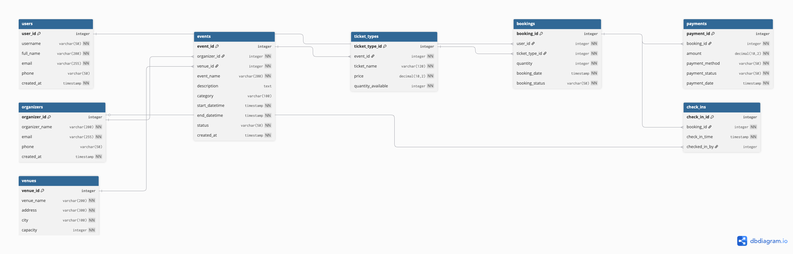

<!-- _class: lead -->

# Event Management Database System

**Database Fundamentals — Project Defense**

Saif Aghezzaf & Kelvin-Air · May 2026

Repo: `DB_Proj_2026_Event_Planner` · Demo: `https://event-management-lzcd.onrender.com`

---

## Project scope

**Database**
- 8 relational tables: event lifecycle + analytics
- PostgreSQL DDL, seed data, indexes, 3 course SQL queries

**Frontend (MVP)**
- Simple React UI to **demonstrate** database operations
- Guest + organizer login (separate `users` / `organizers` tables)

**Out of scope (by design)**
- No chat, recommendations, maps, refunds, or multi-currency

---

## System logic: event lifecycle

| Step | Who | Database |
|------|-----|----------|
| 1 | Organizer creates event | `INSERT events`, `INSERT ticket_types` |
| 2 | Guest books ticket | `INSERT bookings`, `INSERT payments` |
| 3 | Payment completes | `payment_status = 'completed'` |
| 4 | Door check-in | `INSERT check_ins` |
| 5 | Reports | `SELECT` + `JOIN` + `GROUP BY` |

**Flow:** create → book → pay → check-in → analytics

---

## Bookings, payments, and check-ins

| Stage | Meaning | Table |
|-------|---------|--------|
| **Booking** | Intent to attend | `bookings` |
| **Completed payment** | Valid revenue (EUR) | `payments` |
| **Check-in** | Actually attended | `check_ins` |

- Revenue queries use **`payment_status = 'completed'`** only
- Attendee counts use **confirmed** bookings + **completed** payments
- A booking alone does not prove revenue or attendance

---

## Relational schema: 8 core tables

**Entities**
- `organizers` — create events
- `users` — book tickets (guests)
- `venues` — locations (`capacity`)
- `events` — schedule (`start_datetime`, `end_datetime`, `status`)
- `ticket_types` — price + `quantity_available` per event

**Transactions**
- `bookings` — `user_id` + `ticket_type_id` + `quantity`
- `payments` — **1:1** with booking (composite PK = `user_id`, `ticket_type_id`, `booking_date`)
- `check_ins` — **0..1** per booking (same composite PK as booking)



---

## Keys, constraints, and seed data

**Relationships (examples)**
- `events` → `organizers`, `venues`
- `ticket_types` → `events`
- `bookings` → `users`, `ticket_types`
- `payments` → `bookings` · `check_ins` → `bookings`

**Constraints**
- FKs with `ON DELETE CASCADE` · `end_datetime > start_datetime`
- Status CHECKs: event `pending|ongoing|done` · booking `pending|confirmed|cancelled` · payment `pending|completed|failed`
- One payment per booking · prices/amounts ≥ 0

**Seed (spec §10):** 5 organizers · 5 venues · 10 events · 15 users · 20 ticket types · 40 bookings · 40 payments · 18 check-ins — mixed statuses for realistic queries

---

## Frontend demo: database operations

| Screen | SQL operation |
|--------|----------------|
| Browse events (+ date filters) | `SELECT` from `events` (+ joins) |
| Book ticket | `INSERT bookings`, `INSERT payments` |
| Create event (organizer) | `INSERT events`, `INSERT ticket_types` (`Standard`) |
| Door check-in | `INSERT check_ins` |
| My stats (organizer) | Analytics APIs mirror `queries/*.sql` |

The UI is a **lens** on the database — not the grading focus.

---

## SQL analytics: three course reports

| # | Question | Definition (spec §6) |
|---|----------|----------------------|
| **1** | Attendees per event | `SUM(bookings.quantity)` where `booking_status = 'confirmed'` and `payment_status = 'completed'` |
| **2** | Revenue per organizer | `SUM(payments.amount)` where `payment_status = 'completed'` |
| **3** | Attendance rate (last 3 months) | Check-ins vs bookings per event in the window (`queries/03_*.sql`) |

Files: `queries/01_attendees_per_event.sql` · `02_revenue_per_organizer.sql` · `03_attendance_rate_last_3_months.sql`

---

## Revenue query: completed payments only

```sql
COALESCE(SUM(CASE
  WHEN p.payment_status = 'completed' THEN p.amount
  ELSE 0
END), 0) AS total_revenue
```

- Join path: `organizers` → `events` → `ticket_types` → `bookings` → `payments`
- **`LEFT JOIN`** from organizers — organizers with €0 still appear
- Pending / failed payments are **excluded**

---

## Attendance rate: intent vs turnout

```text
attendance_rate_percent =
  check_ins ÷ bookings × 100   (per event, last 3 months)
```

- **Bookings** = planned attendance
- **Check-ins** = who actually arrived
- Helps spot events with interest but weak turnout

*Course query 3 uses `events.start_datetime` in the last 3 months — see report for exact window.*

---

<!-- _class: lead -->

## Final result

- Modeled the event lifecycle with **8 relational tables**
- Protected data with **PKs, FKs, CHECK constraints**, and indexes
- Built **SQL analytics** for attendees, revenue, and attendance rate
- Demonstrated the flow with a **working frontend MVP** on Render

> Relational design turns event activity into reliable operational and analytical data.

